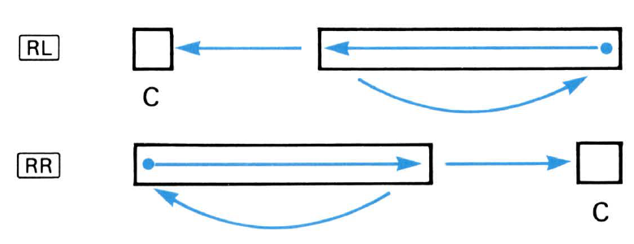

# Welcome to the official documentation for the Saturnine Assembler
This documentation will provide an overview of the Saturnine Assembler, including the features it provides, the syntax it uses, and how to use it to write programs for the HP-16C Simulator and the JRPN HP-16C Simulator.

Please note that this documentation is a work in progress and will be updated as the SRPN Assembler project progresses. If you have any questions or suggestions for the documentation (or the project in general), please feel free to reach out.

## Table of Contents
1. [Introduction](##introduction)
2. [Features](##features)
3. [System Architecture](##system-architecture)
    a. [Registers](###registers)
    b. [Numerical Representation Modes](###numerical-representation-modes)
        i. [Integer Mode](####integer-mode)
        ii. [Floating Point Mode](####floating-point-mode)
    c. [Memory](###memory)
        i. [Memory Map](####memory-map)
        ii. [Direct Addressing](####direct-addressing)
        iii. [Indirect Addressing](####indirect-addressing)
    d. [Flags](###flags)
        i. [User Flags](####user-flags)
        ii. [System Flags](####system-flags)
    e. [Subroutines](###subroutines)
    f. [`STATUS` and `MEM`](###status-and-mem)
4. [Instruction Set](##instruction-set)
    a. [Numeric Input](###numeric-input)
    b. [Arithmetic Operations](###arithmetic-operations)
    c. [Logical Operations](###logical-operations)
    d. [Bitwise Operations](###bitwise-operations)
    e. [Double Operations](###double-operations)
    f. [Stack Operations](###stack-operations)
    g. [Memory Operations](###memory-operations)
    h. [Flag Operations](###flag-operations)
    i. [Control Operations](###control-operations)
    j. [System Operations](###system-operations)
    k. [Pseudo-Instructions](###pseudo-instructions)
    l. [Functions not available Saturnine](###functions-not-in-saturnine)
5. [Syntax](##syntax)
6. [Usage](##usage)
7. [Limitations](##limitations)

## Introduction
Saturnine is a custom assembly language designed specifically for the HP-16C calculator. It is intended to be used with the JRPN HP-16C Simulator to write programs that can be run on the simulator. It is modeled on the HP-16C keystroke programming language provided in the HP-16C manual with some small simplifications for ease of programming. The Saturnine Assembler is a single-pass assembler designed to be easy to use and to provide a familiar programming environment for those who are already familiar with the HP-16C calculator.

The Saturnine Assembler gets its name from the JRPN HP-16C Simulator. JRPN stands for Jovial Reverse Polish Notation. One meaning of "Jovial" is "of Jupiter". The next planet after Jupiter is Saturn, so the name "Saturnine" was chosen. The word "Saturnine" has a few meanings, one of which is "gloomy or sullen in temperament". This is a appropriate given the HP-16C's challenge to program.

This guide will repeat lots of information from the HP-16C manual. Half of the reason for its existence is to serve as my notes while learning the HP-16C keystroke programming language. I hope it will be useful to others as well.

## Features
The Saturnine Assembler provides a number of features that make it easy to write programs for the HP-16C calculator. These features include:
- A simple and intuitive syntax based on the sample programs in the HP-16C manual.
- A comprehensive instruction set that covers all of the operations available on the HP-16C calculator.
- Support for comments using a `//` prefix.
- Support for automatic assembly of the `f` and `g` modifier keys.
- Ability to specify the base of the number being entered (binary, octal, decimal, or hexadecimal).
- Ability to enter multi-digit numbers as an immediate.
- Ability to use negative numbers as an immediate.
- Ability to enter floats in scientific notation.
- Support for optionally specifying the initial mode settings for the calculator.
- Warnings for carry and out-of-range errors and other issues if the initial mode settings are supplied. 
- Support for throwing errors if the program is too large for the memory.
- Support for throwing errors if addresses are out of range.
- Support for directly addressing the first 32 storage registers in decimal.
- Support for pseudo-instructions to simplify certain operations.

## System Architecture
This will be my attempt to summarize how the system architecture works on the HP-16C. This is a work in progress and will be updated as I learn more. You may find comparisons to MIPS, the only other assembly language I have experience with. However, the two are quite different. I struggled on how exactly to order the categories in this section. I decided to simply copy the order of the HP-16C manual, however knowledge of some categories is required to understand others. I will try to make it clear when this is the case.

### Registers
The HP-16C has 6 registers. It has a 4 register stack that can be used to store intermediate values, a Last X register which retains a copy of the X register, and an I register for indexing. 
The stack registers, in *reverse* order, are as follows:
- X: The main register. It is the closest thing the HP-16C has to a general purpose register. Most operations are performed using the X register. It's contents are what is generally displayed on the screen and it is the only register that can be directly accessed.
- Y: The second register. It is used for calculations that require 2 operands and to store intermediate values during calculations.
- Z: The third register. It is used to store intermediate values during calculations.
- T: The fourth register. It is used to store intermediate values during calculations. It is lost when a new value is entered into the X register.

The stack registers can rotate depending on the operation. There are 3 types of operations: Stack Lift, Stack Drop, No Stack Change. These most easily understood by looking at the stack as a vertical list of registers. Stack Lift operations move the registers up, Stack Drop operations move the registers down, and No Stack Change operations leave the registers in place. Here is a diagram showing these operations:

Most notably, entering numbers and `ENTER` are Stack Lift operations, and arithmetic and logical operations are Stack Drop operations. 

The values stored in the stack can be rotated into and out of the X register using the `R^` and `Rv` instructions. The values of the X and Y registers can also be swapped with `X<>Y`. These allow the Y, Z, and T registers to be used more like general purpose registers. 

Additionally, there are 2 more registers, however they are not part of the stack:
- Last X: This register stores the value of the X register before the last operation was performed. It is useful for recalling the previous value of the X register. Example: 

    | Keypress Sequence | Registers       |
    |-------------------|-----------------|
    | `1`, `ENTER`      | X <- 1          |
    | `2`               | X <- 2, Y <- 1  |
    | `+`               | X <- 3, Last X <- 2, Y == 1 |
    | `LST-X`           | X <- 2, Last X == 2, Y == 1 |
- I: This register is used to store the index of the current memory register. It is used in conjunction with the memory operations to allow for indirect memory access. This allows for more flexible memory operations. It can also be used with special functions to simplify for-loop control. 

### Numerical Representation Modes
The HP-16C has 2 main modes: integer, and floating point. The vast majority of calculations are done in integer mode since it is far more fully featured. The two modes are mostly incompatible with each other - the numbers in each do not have the necessarily same cardinality (i.e., numerical value) in each format. Converting between the two is possible, but not always straightforward. See the [Floating Point Mode](####Floating-Point-Mode) section for more information. 

#### Integer Mode
In integer mode, the HP-16C can store numbers in 4 different bases: `binary`, `octal`, `decimal`, and `hexadecimal`. For the Saturnine Assembler, to specify the base of the number, use `0b###` for `binary`, `0o###` for `octal`, `0d###` for `decimal`, and `0x###` for `hexadecimal`. If no base is specified, the number is assumed to be in `decimal`.

#TODO: Understand how the starting base affects the program. Will probably need to wait until I have access to a physical 16C to test this.

The HP-16C can store integers in 180 different combinations of encodings. The original purpose of this is so you can set your HP-16C to whatever encoding your computer uses. The HP-16C was primarily a debugging tool for computer engineers working in assembly, so this feature was useful, but not so relevant for the Saturnine Assembler. 

The HP-16C stores integers in 1 of 3 different encodings: `unsigned`, `1's complement`, and `2's complement`. The encoding set in Saturnine by using the `UNSIGNED`, `1's`, `2's` instructions, respectively. The default is `2's complement`. For most purposes, you should set the HP-16C to `2's complement` encoding for signed integers, or `unsigned` for unsigned integers. `1's complement` mode arithmetic is weird and is effected by the carry flag and has -0. While you might find it useful for debugging a UNIVAC, I will not be discussing it further as it is not useful for programming.  

The HP-16C can store integers in any word size between `4-` and `64-bits`. This means it is still actually useful for modern 64-bit computers. By default, the HP-16C is set to `16-bit` word size. The word size can be set using the `WORD` instruction. For most purposes, you should set the HP-16C to either `4-bit`, `8-bit`, `16-bit`, `32-bit`, or `64-bit` word size, depending on the size of the integers you are working with. I am unaware of any reason to use the other word sizes for integers. Maybe if you wanted to store `7-bit` integers for ASCII characters, but that seems like a stretch. Numbers that are too large to fit in the word size cannot be entered. Results of calculations with values larger than 2^[WORD SIZE] will cause an out-of-range error (flag 5 / `G` annunciator). The X register's value will be the result of the operation modulo 2^[WORD SIZE].

The word size not only affects when the maximum storable value in a register, but also how many much memory is available. The HP-16C has 203 Bytes of memory. This is divided by the word size to get the number of storage addresses. This will be discussed in more detail in the [Memory](###Memory) section.

#### Floating Point Mode
In floating point mode, the HP-16C can do calculations with decimals. The HP-16C does not use the IEEE 754 Standard for Floating Point Arithmetic. The standard not published until 1985, 4 years after the HP-16C was released. In 1982 at release, the proposal was only a draft. Notably, HP did include a program in the manual to convert between the two formats, but does not use the IEEE 754 standard internally. This limits the usefulness of the HP-16C for modern floating point applications. Additionally, many of the operations that are available in integer mode are not available in floating point mode. See below for these operations:

To enter floating point mode, use the `FLOAT #` instruction, where `#` is the number of decimal places to use. If a `.` is entered instead of a number, the 16C will display the floating point number in scientific/engineering notion with 6 decimal place. The last 2 digits on the display (i.e., those to the right of the gap) are the exponent.
- Example: `FLOAT 2`; `3`: DISPLAY == 3.00
- Example: `FLOAT .`; `300`: DISPLAY == 3.000000 02 (== 3.000000 * 10^2)

Numbers can be entered in scientific notion using the `EEX` button to set the exponent. 
- Example: `FLOAT 2`; `3`; `EEX`; `2`: DISPLAY == 300.00
- Example: `FLOAT .`; `3`; `EEX`; `2`: DISPLAY == 3.000000 02 (== 3.000000 * 10^2)
The Saturnine Assembler also allows floats to be entered in scientific notation using `#E#` where the first `#` is the mantissa and the second `#` is the exponent.
- Example: `FLOAT 2`; `3E2`: DISPLAY == 300.00

Internally, the HP-16C stores floating point numbers with a 10 digit mantissa and a 2 digit exponent (#.### ### ### * 2 ^##). This means that the HP-16C can store floats between +/- 9.999999999 * 10^99. Results of calculations with values larger or smaller than these limits will cause an out-of-range error (flag 5 / `G` annunciator) with X <- +/- +/- 9.999999999 * 10^99. The smallest value that can be stored is 1.000000000 * 10^-99. Any values smaller than this will be rounded to 0.

The value in the initial display will be Y*2^X, where Y and X are the integer values stored in the Y and X registers. This means that integers can be converted to floating point numbers by setting the X register to 0. Returning to integer mode will not convert the floating point number back to an integer. The X and Y registers will be set to values such that X * 2^Y == the floating point number previously displayed. 
- Example: `3`; `ENTER`; `2`; `FLOAT 2`: X == 2, Y == 3, Display 12.00 (== 3 * 2^2 == 3 * 4 == 12)

On converting to floating point mode, the stack and the LAST X registers are cleared. The I register and the storage registers are not affected. The complement mode is maintained, but not in use. On returning to integer mode, the registers are not cleared (note that they will not be converted to integers either). However, the X and Y registers will be altered as described above.

Floating point mode has a word size of `56-bit`. This means an absolute maximum of 29 floating point values can be stored in memory, assuming no program is loaded. Returning to integer mode maintains this word `56-bit` size. 

### Memory
The HP-16C has a combined 203 bytes for program *and* data memory. This poses significant challenges for programming. Of course, this restriction is also where the fun begins - the best art is made under the tightest constraints. 

#### Memory Map
Here is the memory map of the HP-16C:

The memory is divided into 2 sections: program memory and data memory. The program memory is used to store the program that is currently being run. The data memory is used to store data that is used by the program (or generally for the calculator). The program memory is divided into program lines. Each program line occupies 1 byte and can be thought of as a single instruction. Program memory is allocated 7 bytes at a time (e.g., there is no difference in having a 1 byte program and a 7 byte program in terms of available data memory). 

Any memory not being used in a program (in multiples of 7 lines) is automatically allocated as data memory. As more program memory is used, less data memory is available. The values in the highest registers are automatically overwritten and lost by the program memory. The data memory is divided into storage registers. The number of storage registers available and their size depend on the word size set in the calculator. The size of the storage registers is the word size, rounded up to the nearest nibble (4-bits). In floating point mode, the word size is always `56-bit` with a maximum of 29 storage registers. **The number of storage registers available = ((203 Bytes) - (# of program lines)) / (word size in Bytes, rounded up).** If the word size changes after data is already stored, the storage registers will be divided or concatenated to fit the new word size.

##### Word Size and Maximum Number of Registers

| Word Size | Max # of Regs |
|-----------|---------------|
| 4         | 406 |
| 8         | 203 |
| 16        | 101 |
| 32        | 50 |
| 56 (Floats) | 29 |
| 64        | 25 |

#### Direct Addressing
The first 32 storage registers can be addressed directly for storing and recalling values. The remaining registers can only be access indirectly using the index register (see below). To access a storage register directly, use the `STO #` and `RCL #` instructions, where `#` is the number of the storage register (0-31). The `STO` instruction stores the value in the X register in the specified storage register, and the `RCL` instruction recalls the value from the specified storage register into the X register. The Saturnine Assembler will automatically convert the storage register number to the appropriate key press on the HP-16C. 

#### Indirect Addressing
The Index register I is a permanent storage register that can be used to indirectly address other storage registers, indirectly branch to program labels, and hold loop counters for program loop control. Unlike other storage registers, *the Index register is always 68 bits*, regardless of current word size, and it is never converted to lines of program memory.

Values can be stored in the Index register using the `STO I` instruction, and recalled using the `RCL I` instruction. The value of the Index register can also be swapped with the X register with the `X<>I` instruction. 

Data registers can be access indirectly by using the `(i)` instruction. Using `STO (i)` will store the value in the X register in the storage register whose index is stored in the I register. Using `RCL (i)` will recall the value from the storage register whose index is stored in the I register into the X register. The value of this indirectly addressed register can also be swapped with the value in the X register using the `X<>(i)` instruction. This is the only way to access the storage registers beyond the first 32.

By placing an index value in I, you can indirectly branch to a location (`GTO I`) and indirectly call a subroutine (`GSB I`). For instance, if I <- -14, then `GTO I` instruction would transfer program
execution to Label E (|-14| == 14 == 0xE). The `GSB I` instruction would transfer program execution to Label E and store the return address.

The `DSZ` and `ISZ` instructions can be used to simplify loop. `DSZ` is used to decrement the value in the I register and does the next instruction if the value is 0. `ISZ` is used to increment the value in the I register *and then* does the next instruction if the value is 0. Generally, the next instruction is a `GTO` instruction to go to the start/end of the loop.

### Comparison Operations
The HP-16C has 12 comparison instructions that can be used to control the flow of a program. These operations test either:
- The values in the X and Y registers
    - `X<=Y`, `X>Y`, `X==Y`, and `X!=Y`
- The value in the X register
    - `X<0`, `X>0`, `X==0`, and `X!=0`
- The value in the I register
    - `DSZ` and `ISZ`
- Bits in the X register
    - `B?`
- Flags
    - `F?`
These instructions operate on a **"DO IF TRUE"** basis. If the condition is true, the next instruction is executed. If the condition is false, the next instruction is skipped.**

### Subroutines
The HP-16C can use subroutines to simplify function calls. Instead of using `GTO` to jump to a label, you can use `GSB` to jump to a label and store the return address. The return address is stored in special, non-user accessible registers *(I believe - manual is not clear on this and I do not have my 16C on hand to check)*. To return from a subroutine, use the `RTN` instruction. This will jump to the program line after the relevant `GSB` instruction. Note that you cannot have nested subroutines more than 4 levels deep. 

### Flags
The HP-16C has 6 flags that can be set during programming. Flags 0, 1, and 2 are user flags that can be set, cleared, and tested by the programmer. Flags 3, 4, and 5 are system flags that are set automatically by the calculator. The `SF #` instruction is used to set a flag, the `CF #` instruction is used to clear a flag, and the `F?` instruction is used to test a flag. The `F?` instruction will skip the next instruction if the X-th flag is set. 

#### System Flags
Flags 3, 4, and 5 are system flags that are set automatically by the calculator. These flags are used change settings on the calculator or to indicate errors. They can still be set, cleared, and tested by the programmer if needed. They are generally only set by operations in integer mode, but some floating point operations can set them as well. The system flags are as follows:
- Flag 3: This flag controls the display of leading zeros. When it is set, zeros to the left of the highest nonzero digit are displayed. When it is clear (the default condition), the display of leading zeros is suppressed. (Note that leading zeros are always suppressed in Decimal and Floating-Point Decimal modes.)
- Flag 4: This flag is the carry flag. It is set when a carry occurs during an arithmetic operation. The carry flag is displayed by the `C` annunciator on the calculator.
- Flag 5: This flag is the out-of-range flag. It is set when a result is too large to be displayed on the calculator. The out-of-range flag is displayed by the `G` annunciator on the calculator.

See this chart to see which operations affect the carry and out-of-range flags:

### `STATUS` and `MEM`
This largely does not apply to the Saturnine Assembler, but is useful to know. 

When in `STATUS` mode, the HP-16C will display the status of the calculator modes. This includes, in order, the complement mode, the word size, and the current status of the `flags 3, 2, 1, and 0`. Note that `flags 4 (carry)` and `5 (out-of-range)` are always displayed by the `C` and `G` annunciators respectively. See the diagram below for the layout of the status display:

When in `MEM` mode, the HP-16C will display the status of the calculator memory. The display will show the number of program lines (`P-#`) used and the number of storage registers available (`r-###`). 

## Instruction Set
Each instruction in the Saturnine Assembly Language corresponds to a key press on the HP-16C calculator. Instructions are all based on the keys of 16C, but with some changes to make them typeable from a standard QWERTY keyboard. **Instructions are not case sensitive.** The documentation below will list them as they are on the HP-16C keys, but you may see them in all lowercase in the other files. 

The following is a list of the instructions available in the Saturnine Assembly Language:
### Numeric Input
- `0` through `9`: Enter the corresponding digit in base 10.
- `.`: Enter the decimal point in floating-point mode.
- `A` through `F`: Enter the corresponding digit in base 16.
- `CHS`: Set the sign of the number to negative in 1's or 2's complement mode. Note that the Saturnine Assembler allows for negative numbers to be entered directly (`-#`), so the `CHS` instruction is not generally necessary.
- To specify the base of the number, use 0b### for binary, 0o### for octal, 0d### for decimal, and 0x### for hexadecimal. If no base is specified, the number is assumed to be in decimal.
    - For negative numbers, use -0b### for binary, -0o### for octal, -0d### for decimal, and -0x### for hexadecimal. -### is also acceptable for decimal numbers.
- Note that entering a number is its own operation and requires a separate instruction to do an operation with it.
- `EEX`: Enter the exponent in floating-point mode. See the [Floating Point Mode](####floating-point-mode) section for more information.
- Examples (in 2's complement mode with an 8-bit word size):
    - `3`: X <- 3
    - `0b1010`: X <- 0d10
    - `0xA`; `CHS`; `DEC`: X <- 0xA; X <- 0xF6; X <- -10

### Arithmetic Operations
- `+`: X <- X + Y
    - Add the number in the X register to the number in the Y register and store the result in the X register.
- `-`: X <- Y - X
    - Subtract the number in the X register from the number in the Y register and store the result in the X register.
    - Example:
        - `5`; `3`; `-`: X == 2
        - X <- 5; X <- 3, Y <- 5; X <- (5 - 3) == 2
- `*`: X <- X * Y
    - Multiply the number in the X register by the number in the Y register and store the result in the X register.
- `/`: X <- Y / X
    - Divide the number in the Y register by the number in the X register and store the result in the X register.
    - Example:
        - `10`; `2`; `/`: X == 5
        - X <- 10; X <- 2, Y <- 10; X <- (10 / 2) == 5
- `RMD`: X <- Y % |X|
    - Calculate the remainder of the division of the number in the Y register by the absolute value of the number in the X register and store the result in the X register.
- `ABS`: X <- |X|
    - Calculate the absolute value of the number in the X register and store the result in the X register.
- `SQRT`: X <- sqrt(X)
    - Calculate the square root of the number in the X register and store the result in the X register.
- If in integer mode, the result of division and square roots are truncated to the nearest integer (i.e., rounded down).
- `1/X`: X <- (1 / X)
    - Calculate the reciprocal of the number in the X register and store the result in the X register.
    - Only works in floating-point mode.
    - Example:
        - `FLOAT 2`; `2`; `1/x`: X == 0.5

### Logical Operations
- `AND`: X <- (X && Y)
    - Perform a bitwise AND operation on the number in the X register and the number in the Y register and store the result in the X register.
    - Example:
        - `0b1010`; `0b1100`; `AND`: X == 0b1000
- `OR`: X <- (X || Y)
    - Perform a bitwise OR operation on the number in the X register and the number in the Y register and store the result in the X register.
    - Example:
        - `0b1010`; `0b1100`; `OR`: X == 0b1110
- `XOR`: X <- (X ⊕ Y)
    - Perform a bitwise XOR operation on the number in the X register and the number in the Y register and store the result in the X register.
    - Example:
        - `0b1010`; `0b1100`; `XOR`: X == 0b0110
- `NOT`: X <- ~X
    - Perform a bitwise NOT operation on the number in the X register and store the result in the X register.
    - Example:
        - `0b1010`; `NOT`: X == 0b0101

### Bitwise Operations
- `SL` and `SR`: X <- X << 1 and X <- X >> 1
    - Shift the number in the X register left or right by one bit and store the result in the X register.
    - The bit shifted out is stored in the carry flag.
    - A 0 is shifted in from the left for `SL` and a 0 is shifted in from the right for `SR`.
    - Example:
        - `0b1010`; `SL`: X == 0b0100, carry == 1
    
    
- `LJ`: Left justify
    - Shift the number in the X register left until the highest bit is set and store the result in the Y register.
    - The number of shifts required to do this is stored in the X register.
    - Example (in 2's complement mode with an 8-bit word size):
        - `BIN`; `0b1111`; `LJ`: X == 4, Y == 0b11110000
- `ASR` (and `ASL`): X <- X >> 1 (and X <- X << 1)
    - Arithmetic shift right (and arithmetic shift left)
    - Shift the number in the X register right by one bit and store the result in the X register.
    - The bit shifted out is stored in the carry flag.
    - A 0 is shifted in from the left if the MSB is clear (positive numbers in `2's complement`) and a 1 is shifted in from the left if the MSB is set (negative numbers in `2's complement`).
    - Note that the `ASL` instruction is a pseudo-instruction. It is not available on the HP-16C calculator, but is included in the Saturnine Assembler for convenience. It is equivalent to the `SL` instruction
    - Example (in 2's complement mode with an 4-bit word size):
        - `0b1010`; `ASR`: X == 0b1101, carry == 0
        - `0b1101`; `ASR`: X == 0b1110, carry == 1
        - `0b1010`; `ASL`: X == 0b0100, carry == 1
- `RL` and `RR`: X <- X rotated left and right
    - Rotate the number in the X register left or right by one bit and store the result in the X register.
    - The bit rotated out is copied to the carry flag.
    - Example:
        - `0b1010`; `RL`: X == 0b0101, carry == 1
    
    
- `RLC` and `RRC`: X <- X rotated left and right through the carry flag
    - Rotate the number in the X register left or right by one bit through the carry flag and store the result in the X register.
    - The bit rotated out is moved to the carry flag and the carry flag is moved to the bit rotated in.
    - Example:
        - `0b1010`; `CF 4`; `RLC`: X == 0b0100, carry == 1
    
    
- `RLn`, `RRn`, `RLCn`, and `RRCn`: X <- Y rotated left and right X times through and around the carry flag
    - The bits rotated out are copied to the carry flag.
    - Example:
        - `0b1000`; `RLn 2`: X == 0b0010, carry == 0
- `SB` and `CB`: Set and clear the the Xth bit of the Y register
    - Set and clear the nth bit of the number in the X register.
    - Bits are numbered from 0 to 7, with 0 being the least significant bit (rightmost bit).
    - Example:
        - `0b1000`; `SB 1`: X == 0b1010
        - `0b1010`; `CB 1`: X == 0b1000
- `MASKL` and `MASKR`: Creates a left or right justified string of n 1s, where n is the number in the X register
    - Used to mask off the left or right n bits of a number with a logical operations
    - Example (in 2's complement mode with an 8-bit word size):
        - `3`; `MASKL`: X == 0b11100000
        - `3`; `MASKR`: X == 0b00000111
- `#B`: Sum the bits of the number in the X register
    - Add up the bits of the number in the X register and store the result in the X register.
    - The previous value of the X register is stored in the Last X register.
    - Example:
        - `0b1010`; `#B`: X == 2, Last X == 0b1010

### Double Operations
- `DBL*`: Double multiplication
    - For multiplication of two 8-bit numbers, the result is a 16-bit number. This poses a problem if your word size is 8-bits. The `DBL*` instruction is used to multiply two 8-bit numbers and store the 16-bit result across the X and Y registers.
    - The MSBs are stored in the X register and the LSBs are stored in the Y register.
    - Note that this causes weird results in `DEC` and also in `HEX` and `OCT` modes if the word size is not a multiple of 4 and 3 respectively due to bits not being aligned with the final representation.
    - Example (in 2's complement mode with an 4-bit word size):
        - `0b1010`; `0b1100`; `DBL*`: X <- 1010; X <- 1100, Y <- 1010; X <- 0111, Y <- 1000
- `DBL/`: Double division
    - This is used to divide a double-width number by a single-width number. The result is a single-width number.
    - The MSBs of the dividend are stored in the Y register and the LSBs are stored in the Z register.
    - The divisor is stored in the X register.
    - The result is stored in the X register.
    - The formula is X <- (Y|Z) / X (`|` means concatenation).
    - Example (in 2's complement mode with an 4-bit word size):
        - `0b1000`; `0b0010`; `0b0011`; `DBL/`
        - X <- 1000; X <- 0010, Y <- 1000; X <- 0011, Y <- 0010, Z <- 1000; X <- ((0010|1000) / 0011) == 1101
- `DBLrmd`: Double remainder
    - This is used to calculate the remainder of a double-width number divided by a single-width number.
    - Functions similarly to `DBL/`, but the result is the remainder of the division (see `DBL/` for more information).

### Stack Operations
- `ENTER`: Puts the number into the X register and pushes the stack up.
    - Not generally necessary in the Saturnine Assembler, but can be used to push the stack up.
- `R^` and `Rv`: Rotate the stack up and down.
    - The order of the stack, from top to bottom, is: T, Z, Y, X
- `X<>Y`: Swap the X and Y registers.
    - Example:
        - `5`; `3`; `X<>Y`: X == 5, Y == 3
- `X<>I`: Swap the X and I registers.
    - Example:
        - `5`; `STO I`; `3`; `X<>I`: X == 5, I == 3
- `X<>(i)`: Swap the X register with the storage register whose index is stored in the I register.
    - Example:
        - `5`; `STO I`; `3`; `STO (i)`; `4`; `X<>(i)`: X == 3, R5 == 4
- `CLx`: Clear the X register.
    - Example:
        - `5`; `CLx`: X == 0

### Memory Operations
- `STO #` and `STO I`: R# <- X and I <- X
    - Store the number in the X register in the specified storage register.
    - Example:
        - `5`; `STO 3`: R3 <- 5
- `RCL #` and `RCL I`: X <- R# and X <- I
    - Recall the number from the specified storage register into the X register.
    - Example:
        - `RCL 3`: X <- R3
- `STO (i)` and `RCL (i)`: R(I) <- X and X <- R(I)
    - Store and recall the number in the X register in the storage register whose index is stored in the I register.
    - Example:
        - `5`; `STO I`; `3`; `STO (i)`: R5 <- 3

### Flag Operations
- `SF #` and `CF #`: Set and clear the #-th flag
    - Set and clear the #-th flag.
    - Note that flags 0, 1, and 2 are user flags and flags 3, 4, and 5 are system flags. Flag 4 is the carry flag and flag 5 is the out-of-range flag.
    - Example:
        - `SF 1`: Set flag 1

### Control Operations
- `LBL #`: Label the current program line
    - Label the current program line with the specified number 0-F. 
    - The label is the number of the program line.
    - Most programs start with a `LBL 0` instruction.
    - Example:
        - `LBL 5`: Label program line 5
- `GTO #` and `GSB #`: Go to and go to subroutine the specified label
    - Jump to the specified label.
    - The label is the number of the program line to jump to.
    - Example:
        - `GTO 5`: Jump to program line 5
- `RTN`: Return
    - Return from the current subroutine to the line after the last `GSB` instruction.
    - Halts the program and resets the PC to 0 if you are not in a subroutine. 
- `DSZ` and `ISZ`: Decrement and increment the I register and do the next instruction if I == 0 (Skip if I != 0)
- `X<=Y`, `X>Y`, `X==Y`, and `X!=Y`: Compare the X and Y registers
    - Compare the numbers in the X and Y registers and does the next instruction if the condition is met (skips if not met).
    - Example:
        - `5`; `3`; `X<=Y`: Skip the next instruction because 3 <= 5
- `X<0`, `X>0`, `X==0`, and `X!=0`: Test the X register
    - Test the number in the X register and does the next instruction if the condition is met (skips if not met).
    - Example:
        - `5`; `X>0`: Skip the next instruction because 5 > 0
- `B?` - Test the X-th bit of the Y register. If it is set, the next instruction is skipped.
- `F?` - Test the X-th flag. If it is set, the next instruction is skipped.

### System Operations
- `HEX`, `DEC`, `OCT`, `BIN`: Set the base of the number to be subsequently entered to hexadecimal, decimal, octal, or binary, respectively.
- `WSIZE`: Set the word size of the calculator to the X register.
- `UNSIGNED`, `1's`, `2's`: Set the complement mode to unsigned, 1's complement, or 2's complement, respectively.
- `FLOAT #` and `FLOAT .`: Set the calculator to floating-point mode with # decimal places or scientific/engineering notation, respectively.
- `SHOW HEX`, `SHOW DEC`, `SHOW OCT`, `SHOW BIN`: Momentarily pauses the program and displays the X register in the specified base.
    - Think of this as a `print` statement.
- `PSE`: Pause the program and and display the X register. 
    - Not sure how this is different from `SHOW` instructions.
- `WINDOW #`: Sets the segment of the X register to display. The X register is divided into up to 8, 8-digit segments, each of which can be displayed. The default view is 0 (the leftmost segment). The rightmost segment is 7. This will most likely not be very useful for those using the Saturnine Assembler for the JRPN simulator (which has a setting to display all digits), but is included for completeness.
- `<` and `>`: Scroll the display left and right, respectively. This will most likely not be very useful for those using the Saturnine Assembler for the JRPN simulator (which has a setting to display all digits), but is included for completeness.
- `R/S`: This pauses the program and allows the user to enter data. This data could be into the stack or into memory. The program will resume after the user presses `R/S` again. 
- `CLEAR MEM`: Clears all memory registers. 

### Pseudo-Instructions
- `-#`: Enter a negative number. Equivalent to the `#; CHS` instruction sequence. 
- `-#E#`: Enter a negative floating point number in scientific notation. Equivalent to the `#; #; CHS` instruction sequence.
- `ASL`: Equivalent to the `SL` instruction. Shift the number in the X register left by one bit and store the result in the X register.

### Functions not available in the Saturnine Assembler
Not all of the functions available on the HP-16C are available in programming mode. As such, they are not available in the Saturnine Assembler. These functions are described in this excerpt from the HP-16C manual:

## Syntax
The syntax for the Saturnine Assembler is based on the examples in the HP-16C manual and is detailed above. Each line of code in a Saturnine program corresponds to a series of key presses on the HP-16C calculator. Each instruction is written on a separate line and comments are allowed using `//`. One key difference is that writing the `f` and `g` keys is unnecessary. The Saturnine Assembler will add them automatically when assembling. It is recommended that you specify your initial settings at the beginning of your program. Otherwise, the Saturnine Assembler will assume the default settings (2's complement and 16-bit word size). All Saturnine Assembly files should have the `.sat` extension.

The following is an example of the syntax for a Saturnine program:
**WIP**

## Usage
The Saturnine Assembler is a command line tool that can be used to assemble Saturnine Assembly files into a format that can be imported to the JRPN HP-16C calculator simulator (.16c) or printed out and typed into a physical HP-16C. The Saturnine Assembler is written in Python 3.12.3 (other versions may work, but no compatibility is guaranteed). 

The Saturnine Assembler can be run from the command line using the following command:
`Saturnine_Assembler.py [input file] [output file] [options]`

You can also run the Saturnine Assembler without any arguments to enter interactive mode. This will walk you through each argument and allow you to assemble a file without needing to remember the command line arguments.

## Limitations
The Saturnine Assembler is a work in progress and has several limitations. The following is a list of known limitations:
- The argument parsing for `WINDOW` is not perfect. There are some invalid arguments that are not caught by the parser.
- If you do not specify a base for a number, it is assumed to be the previous base set. This can cause issues if you are not careful.
- Sometimes the whitespace in the .16c file is not perfect. This is a known issue, but it does not affect the functionality of the file.